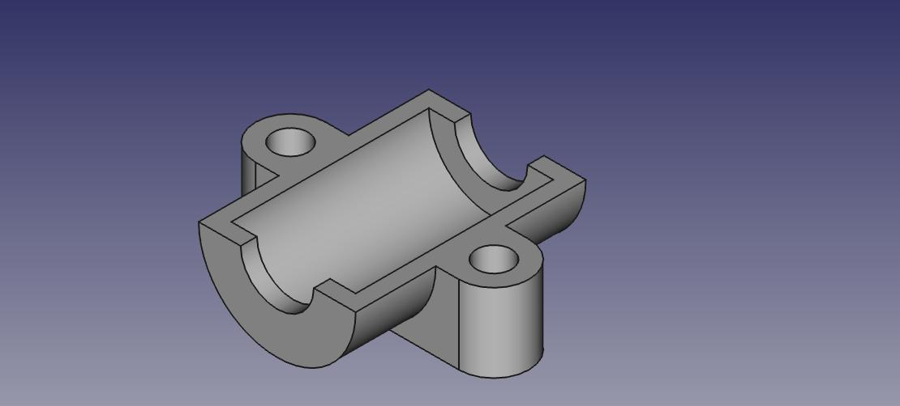

# Cilindrical Part Support

Based on an original design by Joao Sequeira

Support piece for a cilindrical part, like an LM8UU linear bearing.
The design is symmetric (just print two) and tries to save filament
for 3D printing while maintaining resistance.
